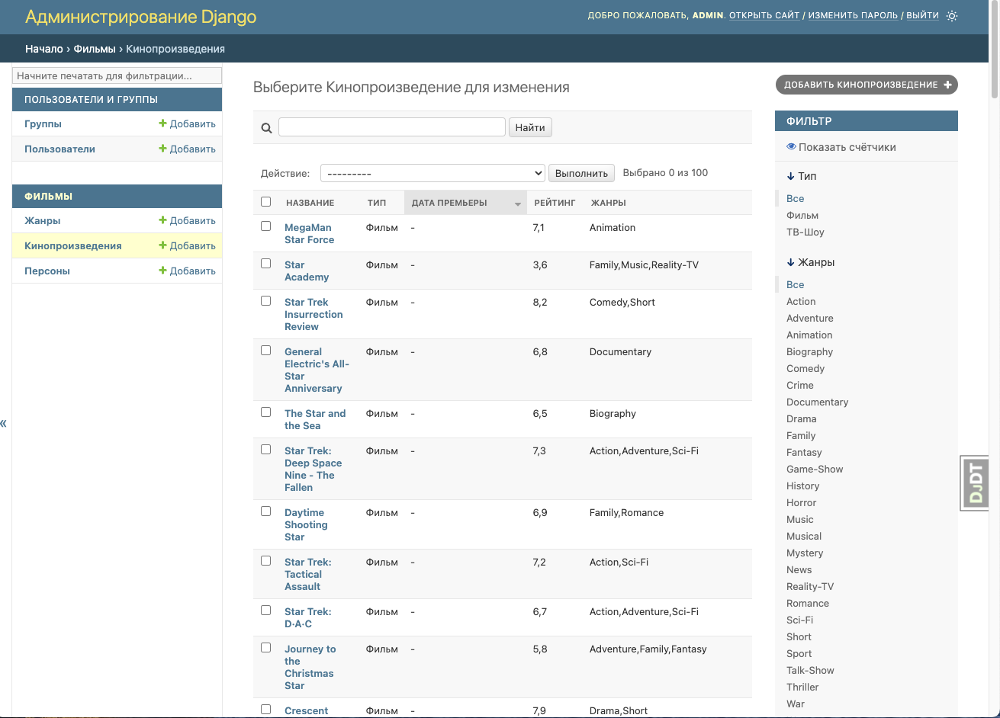

# Задание первого спринта

В консоли можно просмотреть список допустимых команд:

```bash
> make help

admin                          create admin user
compile-trans                  compile translations
django-makemigrations          apply migrations
django-migrate                 apply migrations
help                           Help
make-trans                     make translations
start-app                      start dev server
start-db                       start postgres
stop-db-clear                  stop postgres and clear all
transfer-data                  transfer data from sqlite

```

Запутить весь пайплайн можно командой:

```bash
make start-all
```

Выполнятся следующие команды `install-pip start-db wait_to_db transfer-data django-migrate admin start-app`

- Будут установлены зависимости
- Запустится контейнер с базой данных
- Скрипт ожидание запуска БД, иначе данные не перенесутся и миграции не применятся
- Будет осуществлен перенос данных из sqlite
- Применятся миграции Django
- Будет создан суперпользователь `admin/123123`
- Будет запущено приложение

http://127.0.0.1:8000/admin


